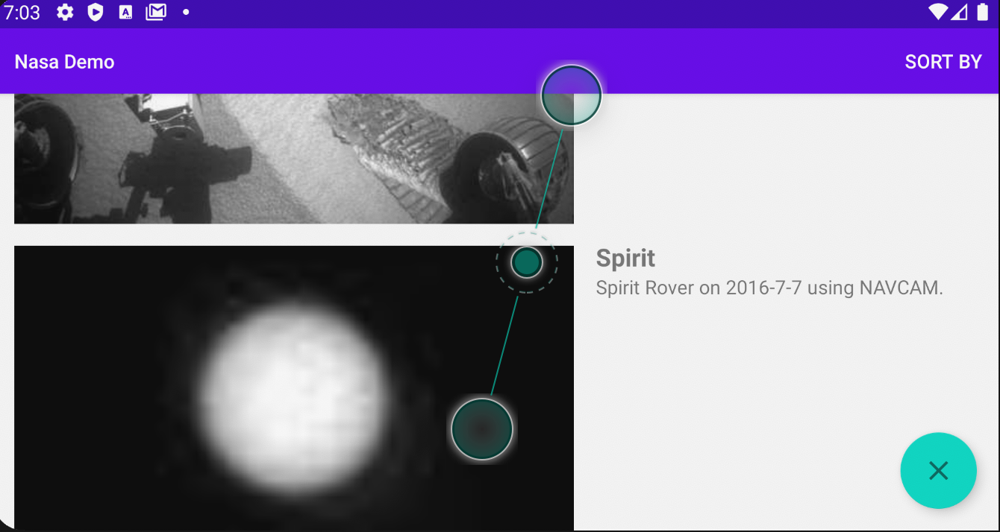
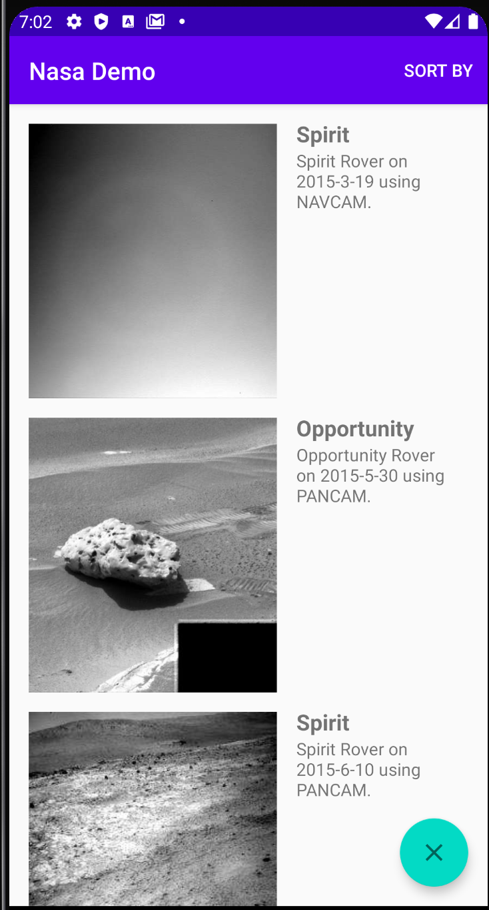

## Project Ronin's Mobile Project

1. **Build Instructions**
   - Clone Project and Use Android Studio 4.0
- Build in Android Studio. Should require nothing more out of the box.
2. **Features**
   * The Action Bar has a sort button. You can choose how you want to sort your photos.
   * The FAB appears on debug builds. Can toggle and see the states of full data and missing data. The missing data wasn't valid JSON so I copied, fixed it, and placed it on a Github Gist.
3. **Your Focus Areas.**
   Software Architecture, Code Style, Readability, Robustness and using standard Android development practices.
   * Unit Tests
   * Rotation works
   * Testing JSON with Missing Data
   * Demonstrating use of Coroutines as a viable means of replacing RxJava in current projects.

3. **Copied-in code or copied-in dependencies.**

   I took some code for the DI setup, the errorhandling stack and dependencies from past projects on a private repo. The idea for the domain mapping came from [this project](https://github.com/cobeisfresh/CleanArchitecture-Android-Showcase).
   
4. **What did I not focus on**

   * I didn't deviate too far from the specs. I would create more views for empty, different error states, and no internet states. I opted to use Toasts for the sake of time

   * Optimizing and creating different layours for landscape or tablet configurations.

### Screenshots
<table>
    <tr>
        <td></img></td>
        <td></img></td>
    </tr>
    <tr>
        <td align="center"><b>Horizontal</b></img></td>
        <td align="center"><b>Vertical</b></img></td>
    </tr>
</table>